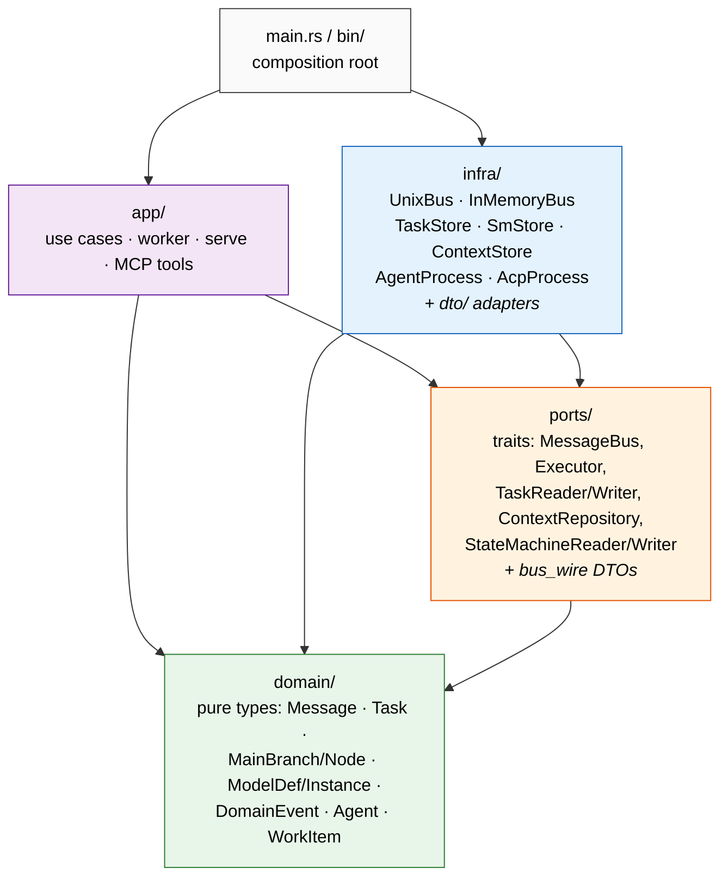
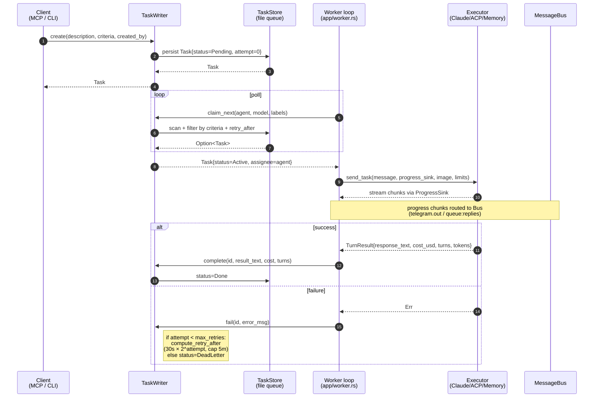
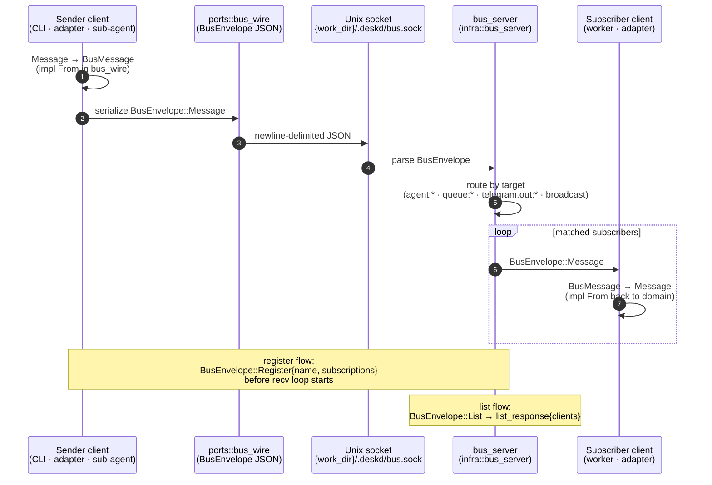
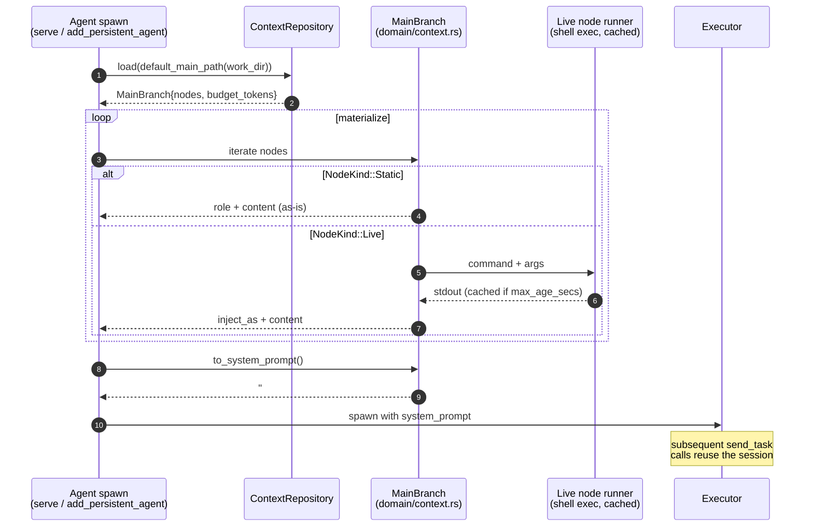
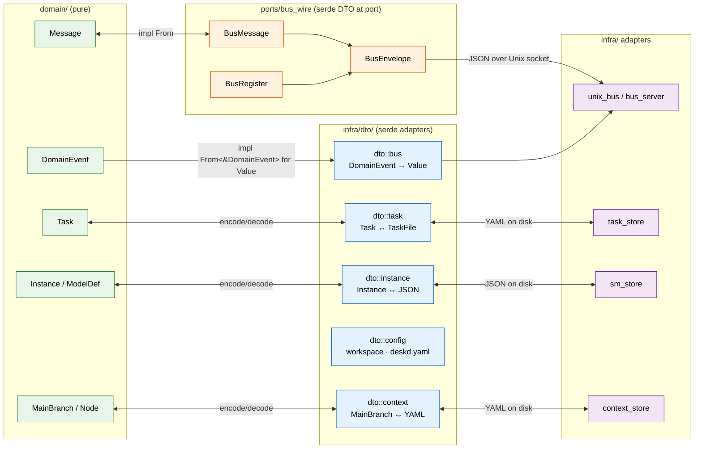

# deskd — Architecture Diagrams

Living architecture documentation. Diagrams reflect the **actual code** as of the post-refactoring layout, not aspirational design. Mermaid renders natively in GitHub.

When the code changes in ways that affect these diagrams, update them in the same PR.

---

## 1. Layer Diagram

deskd follows a hexagonal (ports-and-adapters) architecture. Dependency direction is enforced by the module structure under `src/` and validated by archlint.



**Rules** (enforced by module boundaries):

- `domain/` depends only on `std` and `serde_json::Value`. Pure data types, no serde derives, no I/O.
- `ports/` depends only on `domain/`. Defines trait interfaces (object-safe via `Pin<Box<dyn Future>>`) plus shared wire DTOs in `ports::bus_wire`.
- `infra/` depends on `ports/` + `domain/`. Concrete implementations: Unix sockets, file stores, subprocess executors. Owns `infra::dto/` adapters that carry serde derives.
- `app/` orchestrates domain + ports for use cases (worker loop, serve command, MCP tools, graph engine). Does not depend on `infra/` directly — it receives trait objects from the composition root.
- `main.rs` and the binaries in `src/bin/` wire concrete `infra` types into `app` consumers.

---

## 2. Domain Model

Core types live in `src/domain/` and are referenced by traits in `src/ports/`. Domain types have **no serde derives** — wire/persistence formats are owned by adapter layers.

```mermaid
classDiagram
    class Message {
        +String id
        +String source
        +String target
        +Value payload
        +Option~String~ reply_to
        +Metadata metadata
    }
    class Metadata {
        +u8 priority
        +bool fresh
    }
    class Envelope {
        <<enum>>
        Register(Register)
        Message(Message)
        List
    }

    class Task {
        +String id
        +String description
        +TaskStatus status
        +TaskCriteria criteria
        +Option~String~ assignee
        +Option~String~ result
        +Option~String~ error
        +u32 attempt
        +u32 max_retries
        +Option~String~ retry_after
        +Option~String~ sm_instance_id
    }
    class TaskStatus {
        <<enum>>
        Pending
        Active
        Done
        Failed
        Cancelled
        DeadLetter
    }
    class TaskCriteria {
        +Option~String~ model
        +Vec~String~ labels
    }

    class MainBranch {
        +String agent
        +u32 budget_tokens
        +Vec~Node~ nodes
        +to_system_prompt() String
        +partition_by_tags(groups) Vec~MainBranch~
    }
    class Node {
        +String id
        +NodeKind kind
        +String label
        +u32 tokens_estimate
        +Vec~String~ tags
    }
    class NodeKind {
        <<enum>>
        Static{role, content}
        Live{command, args, max_age_secs, ...}
    }

    class ModelDef {
        +String name
        +Vec~String~ states
        +String initial
        +Vec~String~ terminal
        +Vec~TransitionDef~ transitions
    }
    class TransitionDef {
        +String from
        +String to
        +StepType step_type
        +Option~TaskCriteria~ criteria
        +u32 max_retries
    }
    class Instance {
        <<sm runtime>>
        +String id
        +String model
        +String current_state
    }

    class DomainEvent {
        <<enum>>
        TaskCreated · TaskClaimed · TaskCompleted ·
        TaskFailed · SmTransitioned · etc.
    }

    Message "1" *-- "1" Metadata
    Envelope --> Message
    Task --> TaskStatus
    Task "1" *-- "1" TaskCriteria
    MainBranch "1" *-- "*" Node
    Node --> NodeKind
    ModelDef "1" *-- "*" TransitionDef
    TransitionDef ..> TaskCriteria : may carry
    Instance ..> ModelDef : runs

    note for Message "domain/message.rs<br/>no serde — pure data"
    note for Task "domain/task.rs<br/>retry: exponential backoff"
    note for MainBranch "domain/context.rs<br/>materialized via to_system_prompt()"
    note for ModelDef "domain/statemachine.rs"
    note for DomainEvent "domain/events.rs<br/>JSON via infra::dto::bus"
```

### Port Traits

| Port trait | File | Implementations |
|---|---|---|
| `MessageBus` | `ports/bus.rs` | `infra::unix_bus::UnixBus` (prod), `infra::memory_bus::InMemoryBus` (tests) |
| `Executor` | `ports/executor.rs` | Claude/Memory `AgentProcess`, `AcpProcess` (constructed in `app/worker.rs::start_executor`) |
| `TaskReader` + `TaskWriter` | `ports/store.rs` | `infra::task_store::TaskStore` (file-backed), `infra::memory_store` (tests) |
| `StateMachineReader` + `StateMachineWriter` | `ports/store.rs` | `infra::sm_store`, `infra::memory_store` |
| `ContextRepository` | `ports/store.rs` | `infra::context_store` |

`TaskRepository` and `StateMachineRepository` are blanket-impl supertraits combining the ISP-split reader/writer pairs.

---

## 3. Sequence Diagrams

### 3.1 Task Lifecycle — create, claim, execute, complete



### 3.2 Message Flow — bus routing



The bus server retries the connection with exponential backoff (10 attempts, 100ms initial) — see `app/worker.rs::bus_connect`.

### 3.3 Context Materialization — graph → system prompt → executor



---

## 4. DTO Boundary

Domain types are pure. Serde lives at the edges. Conversions happen at the port boundary so that `infra` adapters can speak wire/file formats without leaking serde into `domain`.



### Where conversions live

| From → To | Module | Notes |
|---|---|---|
| `domain::Message` ↔ `BusMessage` | `ports/bus_wire.rs` | `impl From` in both directions; metadata flattened into wire fields |
| `DomainEvent` → `serde_json::Value` | `infra/dto/bus.rs` | One-way: events are emitted, never parsed back |
| `domain::Task` ↔ task DTO | `infra/dto/task.rs` | YAML on disk in the per-agent task directory |
| `domain::MainBranch` ↔ context YAML | `infra/dto/context.rs` | `default_main_path(work_dir) = {work_dir}/.deskd/context/main.yaml` |
| `domain::Instance` ↔ instance JSON | `infra/dto/instance.rs` | One file per state-machine instance |
| `WorkspaceConfig`, `UserConfig` | `infra/dto/config.rs` | Parsed from `workspace.yaml` and per-agent `deskd.yaml` |

`bus_wire` lives in `ports/` (not `infra/`) because the wire format is part of the contract that any `MessageBus` implementation must speak — multiple adapters share it.

---

## Keeping diagrams honest

These diagrams are checked into `docs/` so they live alongside the code. Updates land in the PR that changes the underlying structure. archlint validates the layer dependency arrows in the **Layer Diagram** against `archlint.yaml`.
